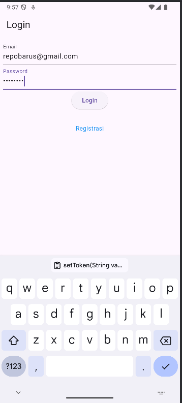
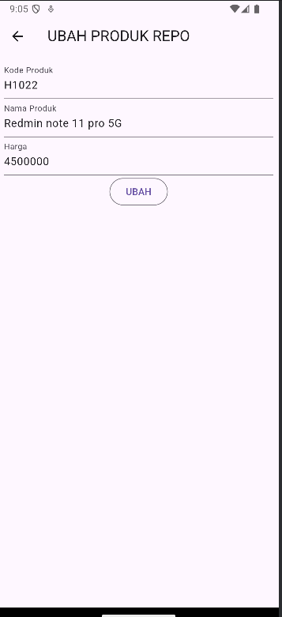

# Tugas pertemuan 4
Nama : Repo Wianata Barus </br>
Nim : H1D022029 </br>
Shift KRS : C </br>
Shift Baru : F </br>

## ScreenShot


# Tugas pertemuan 5
Folder `helper` dalam Flutter digunakan untuk menyimpan fungsi-fungsi utilitas atau kelas-kelas 
yang membantu proses tertentu dalam aplikasi, seperti pengelolaan API, penyimpanan lokal, otentikasi,
dan pengolahan data. Dengan adanya folder ini, kode yang sering digunakan di berbagai tempat dapat dikelola secara modular, 
membuat aplikasi lebih rapi, terstruktur, dan mudah dipelihara.
## Isi folder helper
1. api.dart
2. api_url.dart
3. app_exception.dart
4. user_info.dart

## api.dart
Kode ini adalah kelas `Api` yang berfungsi untuk menangani permintaan HTTP dalam aplikasi Flutter dengan beberapa metode untuk 
mengirimkan data ke server, seperti **POST**, **GET**, **PUT**, dan **DELETE**. Kode ini juga menggunakan **Bearer Token** dari 
`UserInfo` untuk otorisasi setiap permintaan. Jika terjadi kesalahan jaringan atau status kode tidak valid (seperti 400, 401, 403, 422, atau 500),
fungsi `_returnResponse` akan melemparkan pengecualian khusus seperti `BadRequestException`, `UnauthorisedException`, dan `FetchDataException`. 
Ini membuat manajemen kesalahan lebih terstruktur dan mudah ditangani dalam aplikasi.

## api_url.dart
1. baseUrl: Menyimpan URL dasar API server.
2. registrasi dan login: Endpoint untuk registrasi dan login pengguna.
3. listProduk dan createProduk: Endpoint untuk mendapatkan daftar produk dan membuat produk baru.
4. updateProduk(int id): Menghasilkan URL untuk memperbarui produk berdasarkan ID.
5. showProduk(int id): Menghasilkan URL untuk menampilkan produk berdasarkan ID.
6. deleteProduk(int id): Menghasilkan URL untuk menghapus produk berdasarkan ID.

## app_exception.dart
1. AppException (Kelas Induk):
- Implementasi dasar dari exception handling.
- Menyimpan pesan kesalahan (_message) dan prefix (_prefix) untuk mendeskripsikan jenis kesalahan.
- Method toString() mengembalikan gabungan _prefix dan _message.
2. FetchDataException:
- Menangani kesalahan yang terjadi selama komunikasi dengan server.
- Prefix: "Error During Communication: ".
3. BadRequestException:
- Menangani kesalahan request yang tidak valid (HTTP status code 400).
- Prefix: "Invalid Request: ".
4. UnauthorisedException:
- Menangani kesalahan otorisasi, seperti ketika token tidak valid (HTTP status code 401 atau 403).
- Prefix: "Unauthorised: ".
5. UnprocessableEntityException:
- Menangani kesalahan entitas yang tidak dapat diproses (HTTP status code 422).
- Prefix: "Unprocessable Entity: ".
6. InvalidInputException:
- Menangani kesalahan ketika input tidak valid atau tidak sesuai.
- Prefix: "Invalid Input: ".

## user_info.dart
1. setToken(String value):
- Menyimpan token autentikasi ke SharedPreferences dengan kunci "token".
2. getToken():
- Mengambil token autentikasi dari SharedPreferences.
3. setUserID(int value):
- Menyimpan User ID ke SharedPreferences dengan kunci "userID".
4. getUserID():
- Mengambil User ID dari SharedPreferences.
5. logout():
- Menghapus semua data yang tersimpan di SharedPreferences saat logout (termasuk token dan User ID).

# Penjelasan Proses Registrasi

ketika tombol "Registrasi ditekan maka akan memanggil method _submit

```void _submit() {
    _formKey.currentState!.save();
    setState(() {
      _isLoading = true;
    });
    RegistrasiBloc.registrasi(
        nama: _namaTextboxController.text,
        email: _emailTextboxController.text,
        password: _passwordTextboxController.text)
        .then((value) {
      showDialog(
          context: context,
          barrierDismissible: false,
          builder: (BuildContext context) => SuccessDialog(
            description: "Registrasi berhasil, silahkan login",
            okClick: () {
              Navigator.pop(context);
            },
          ));
    }, onError: (error) {
      showDialog(
          context: context,
          barrierDismissible: false,
          builder: (BuildContext context) => const WarningDialog(
            description: "Registrasi gagal, silahkan coba lagi",
          ));
    });
    setState(() {
      _isLoading = false;
    });
  }
```
1. Menyimpan Data Form:
- _formKey.currentState!.save() digunakan untuk menyimpan dan memvalidasi data dari form input pengguna.
2. Menampilkan Loading Indicator:
- setState(() { _isLoading = true; }) digunakan untuk mengubah state aplikasi agar menunjukkan bahwa proses registrasi sedang berlangsung (misalnya, dengan menampilkan loading spinner).
3. Memanggil Fungsi Registrasi:
- Fungsi RegistrasiBloc.registrasi() dipanggil dengan mengirim data nama, email, dan password yang diambil dari TextField menggunakan _namaTextboxController.text, _emailTextboxController.text, dan _passwordTextboxController.text.
4. Menangani Registrasi Berhasil:
- Jika registrasi berhasil, then() dipanggil untuk menampilkan SuccessDialog yang berisi pesan "Registrasi berhasil, silahkan login". Pengguna dapat menutup dialog tersebut dengan klik tombol yang akan memanggil Navigator.pop(context).
5. Menangani Kesalahan Registrasi:
- Jika terjadi kesalahan dalam proses registrasi, onError akan menampilkan WarningDialog dengan pesan "Registrasi gagal, silahkan coba lagi".
6. Menghentikan Loading Indicator:
- Setelah proses selesai (baik berhasil atau gagal), setState(() { _isLoading = false; }) dipanggil untuk menghentikan loading indicator.


## langkah langkah registrasi
1. Input Data Pengguna:
- Pengguna memasukkan nama, email, dan password di form registrasi.
2. Memanggil Fungsi registrasi:
- Data input dikirim ke fungsi registrasi di RegistrasiBloc, yang menyiapkan body request berisi data registrasi.
3. Mengirim Permintaan POST ke API:
- Fungsi Api().post() mengirimkan data ke endpoint API registrasi menggunakan metode HTTP POST.
4. Menunggu Respons dari Server:
- Aplikasi menunggu respons dari server setelah data dikirim.
5. Memproses Respons:
- Respons server (dalam format JSON) di-decode dan dikonversi menjadi objek Registrasi melalui Registrasi.fromJson().
6. Menangani Hasil:
- Jika registrasi berhasil, pengguna diberi tahu melalui dialog sukses.

# Penjelasan Proses Login


``` dart
 Widget _buttonLogin() {
    return ElevatedButton(
      child: const Text("Login"),
      onPressed: () {
        var validate = _formKey.currentState!.validate();
        if (validate) {
          if (!_isLoading) _submit();
        }
      },
    );
  }
void _submit() {
    _formKey.currentState!.save();
    setState(() {
      _isLoading = true;
    });
    LoginBloc.login(
        email: _emailTextboxController.text,
        password: _passwordTextboxController.text
    ).then((value) async {
      print("Login successful: $value");
      if (value.userID != null) {
        await UserInfo().setToken(value.token ?? "");
        await UserInfo().setUserID(value.userID!);
        Navigator.pushReplacement(context,
            MaterialPageRoute(builder: (context) => const ProdukPage()));
      } else {
        throw Exception("UserID is null");
      }
    }).catchError((error) {
      print("Login error: $error");
      showDialog(
          context: context,
          barrierDismissible: false,
          builder: (BuildContext context) => WarningDialog(
            description: "Login gagal: ${error.toString()}",
          )
      );
    }).whenComplete(() {
      setState(() {
        _isLoading = false;
      });
    });
  }
```
1. Menyimpan Data Form:
- _formKey.currentState!.save() digunakan untuk menyimpan dan memvalidasi data dari form input (email dan password).
2. Menampilkan Loading Indicator:
- setState(() { _isLoading = true; }) mengubah state aplikasi untuk menunjukkan bahwa proses login sedang berlangsung (misalnya, dengan menampilkan spinner loading).
3. Memanggil Fungsi Login:
- Fungsi LoginBloc.login() dipanggil dengan mengirimkan data email dan password yang diambil dari TextField menggunakan _emailTextboxController.text dan _passwordTextboxController.text.
4. Menangani Login Berhasil:
- Jika login berhasil, then() dipanggil:
 - Menggunakan print untuk mencetak pesan bahwa login berhasil.
 - Memeriksa apakah userID tidak null. Jika ada, token dan user ID disimpan di SharedPreferences menggunakan UserInfo().setToken() dan UserInfo().setUserID().
 - Setelah itu, pengguna dialihkan ke halaman ProdukPage menggunakan Navigator.pushReplacement().
5. Menangani Kesalahan Login:
- Jika terjadi kesalahan dalam proses login, catchError akan menangkap kesalahan dan mencetak pesan kesalahan. Dialog WarningDialog ditampilkan dengan pesan yang sesuai.
6. Menghentikan Loading Indicator:
- whenComplete() dipanggil setelah proses login selesai, baik berhasil maupun gagal, untuk mengubah state _isLoading menjadi false, menghentikan loading indicator.
## Model Login 
```
    class Login {
      int? code;
      bool? status;
      String? token;
      int? userID;
      String? userEmail;
    
      Login({this.code, this.status, this.token, this.userID, this.userEmail});
    
      factory Login.fromJson(Map<String, dynamic> obj) {
        print(obj);  // Tambahkan ini untuk melihat struktur JSON yang diterima
        return Login(
            code: obj['code'],
            status: obj['status'],
            token: obj['data']['token'],
            userID: int.tryParse(obj['data']['user']['id'].toString()),  // Ubah ini
            userEmail: obj['data']['user']['email']
        );
      }
    } 
```
1. Atribut:
- code, status, token, userID, userEmail: Menyimpan informasi terkait hasil login.
2. Konstruktor:
- Menerima parameter opsional untuk inisialisasi objek Login.
3. Fabrik fromJson:
- Mengonversi data JSON ke objek Login.
4. Mengambil dan menyimpan nilai dari JSON, termasuk token dan ID pengguna.

## Login Bloc
```
import 'dart:convert';
import 'package:tokokita/helpers/api.dart';
import 'package:tokokita/helpers/api_url.dart';
import 'package:tokokita/model/login.dart';
class LoginBloc {
  static Future<Login> login({String? email, String? password}) async {
    String apiUrl = ApiUrl.login;
    var body = {"email": email, "password": password};
    var response = await Api().post(apiUrl, body);
    var jsonObj = json.decode(response.body);
    return Login.fromJson(jsonObj);
  }
}
```

## langkah login
1. Input Data:
- Pengguna memasukkan email dan password di form login.
2. Menyimpan Data Form:
- Data form disimpan dan divalidasi.
3. Memanggil Fungsi Login:
- Fungsi LoginBloc.login() dipanggil dengan email dan password yang dimasukkan.
4. Permintaan ke Server:
- Data dikirim ke server menggunakan metode HTTP POST.
5. Menunggu Respons:
- Aplikasi menunggu respons dari server.
6. Memproses Respons:
- Respons JSON diterima dan diubah menjadi objek Login.
7. Menangani Login Berhasil:
- Jika berhasil, token dan user ID disimpan, dan pengguna dialihkan ke halaman berikutnya.
8. Menangani Kesalahan:
- Jika terjadi kesalahan, pesan kesalahan ditampilkan kepada pengguna.

# Menampilkan Data Produk
```
class Produk {
  String? id;
  String? kodeProduk;
  String? namaProduk;
  var hargaProduk;

  Produk({this.id, this.kodeProduk, this.namaProduk, this.hargaProduk});

  factory Produk.fromJson(Map<String, dynamic> obj) {
    return Produk(
        id: obj['id'],
        kodeProduk: obj['kode_produk'],
        namaProduk: obj['nama_produk'],
        hargaProduk: obj['harga']);
  }
}
```

## produk block 

```
class ProdukBloc {
  static Future<List<Produk>> getProduks() async {
    String apiUrl = ApiUrl.listProduk;
    var response = await Api().get(apiUrl);
    var jsonObj = json.decode(response.body);
    List<dynamic> listProduk = (jsonObj as Map<String, dynamic>)['data'];
    List<Produk> produks = [];
    for (int i = 0; i < listProduk.length; i++) {
      produks.add(Produk.fromJson(listProduk[i]));
    }
    return produks;
  }
}
```

## langkah langkah
1. ProdukPage menggunakan FutureBuilder untuk memanggil ProdukBloc.getProduks().
2. Daftar produk ditampilkan menggunakan ListView.builder.
3. Setiap item produk ditampilkan menggunakan ItemProduk widget.

# Create Produk


## Langkah langkah
1. Pengguna mengakses form tambah produk dari ProdukPage.
2. Pengguna mengisi form dengan kode produk, nama produk, dan harga.
3. Saat tombol "SIMPAN" ditekan, metode simpan() dipanggil.
4. ProdukBloc.addProduk() dipanggil dengan data produk baru.
5. Jika berhasil, pengguna diarahkan kembali ke ProdukPage.
6. Jika gagal, WarningDialog ditampilkan.

```
// produk_form.dart

class _ProdukFormState extends State<ProdukForm> {
  // ... (kode lainnya)

  simpan() {
    setState(() {
      _isLoading = true;
    });
    Produk createProduk = Produk(id: null);
    createProduk.kodeProduk = _kodeProdukTextboxController.text;
    createProduk.namaProduk = _namaProdukTextboxController.text;
    createProduk.hargaProduk = int.parse(_hargaProdukTextboxController.text);
    ProdukBloc.addProduk(produk: createProduk).then((value) {
      Navigator.of(context).push(MaterialPageRoute(
          builder: (BuildContext context) => const ProdukPage()));
    }, onError: (error) {
      showDialog(
        context: context,
        builder: (BuildContext context) => const WarningDialog(
          description: "Simpan gagal, silahkan coba lagi",
        ),
      );
    });
    setState(() {
      _isLoading = false;
    });
  }
}
```

# Read Produk


## Model produk 
```
class Produk {
  String? id;
  String? kodeProduk;
  String? namaProduk;
  var hargaProduk;

  Produk({this.id, this.kodeProduk, this.namaProduk, this.hargaProduk});

  factory Produk.fromJson(Map<String, dynamic> obj) {
    return Produk(
        id: obj['id'],
        kodeProduk: obj['kode_produk'],
        namaProduk: obj['nama_produk'],
        hargaProduk: obj['harga']);
  }
}
```
## Produk block
```
class ProdukBloc {
  static Future<List<Produk>> getProduks() async {
    String apiUrl = ApiUrl.listProduk;
    var response = await Api().get(apiUrl);
    var jsonObj = json.decode(response.body);
    List<dynamic> listProduk = (jsonObj as Map<String, dynamic>)['data'];
    List<Produk> produks = [];
    for (int i = 0; i < listProduk.length; i++) {
      produks.add(Produk.fromJson(listProduk[i]));
    }
    return produks;
  }
}
```
## Langkah langkah
1. Pengguna menekan item produk di ProdukPage.
2. ProdukDetail ditampilkan dengan informasi produk yang dipilih.

# Edit dan Delet Produk



## Edit Produk
```
OutlinedButton(
  child: const Text("EDIT"),
  onPressed: () {
    Navigator.push(
      context,
      MaterialPageRoute(
        builder: (context) => ProdukForm(
          produk: widget.produk!,
        ),
      ),
    );
  },
),
```
```
static Future updateProduk({required Produk produk}) async {
    String apiUrl = ApiUrl.updateProduk(int.parse(produk.id!));
    print(apiUrl);
    var body = {
      "kode_produk": produk.kodeProduk,
      "nama_produk": produk.namaProduk,
      "harga": produk.hargaProduk.toString()
    };
    print("Body : $body");
    var response = await Api().put(apiUrl, jsonEncode(body));
    var jsonObj = json.decode(response.body);
    return jsonObj['status'];
  }
```
1. Pengguna menekan tombol "EDIT" di ProdukDetail.
2. Form produk ditampilkan dengan data produk yang ada.
3. Pengguna mengubah data produk.
4. Saat tombol "UBAH" ditekan, metode ubah() dipanggil.
5. ProdukBloc.updateProduk() dipanggil dengan data produk yang diperbarui.
6. Jika berhasil, pengguna diarahkan kembali ke ProdukPage.
7. Jika gagal, WarningDialog ditampilkan.

## Hapus Produk
```
void confirmHapus() {AlertDialog alertDialog = AlertDialog(
  content: const Text("Yakin ingin menghapus data ini?"),
  actions: [
//tombol hapus
    OutlinedButton(
      child: const Text("Ya"),
      onPressed: () {
        ProdukBloc.deleteProduk(id: int.parse(widget.produk!.id!)).then(
                (value) => {
              Navigator.of(context).push(MaterialPageRoute(
                  builder: (context) => const ProdukPage()))
            }, onError: (error) {
          showDialog(
              context: context,
              builder: (BuildContext context) => const WarningDialog(
                description: "Hapus gagal, silahkan coba lagi",
              ));
        });
      },
    ),
//tombol batal
    OutlinedButton(
      child: const Text("Batal"),
      onPressed: () => Navigator.pop(context),
    )
  ],
);
showDialog(builder: (context) => alertDialog, context: context);
}
```
```
static Future<bool> deleteProduk({int? id}) async {
    String apiUrl = ApiUrl.deleteProduk(id!);
    var response = await Api().delete(apiUrl);
    var jsonObj = json.decode(response.body);
    return (jsonObj as Map<String, dynamic>)['data'];
}
```
## Langkah langkah
- Tombol "DELETE" memunculkan dialog konfirmasi.
- Jika dikonfirmasi, `ProdukBloc.deleteProduk()` dipanggil untuk menghapus produk.
- Setelah berhasil dihapus, navigasi kembali ke `ProdukPage`.

# Penjelasan Logout


```
 drawer: Drawer(
        child: ListView(
          children: [
            ListTile(title: const Text('Logout'),
              trailing: const Icon(Icons.logout),
              onTap: () async {
                await LogoutBloc.logout().then((value) => {
                  Navigator.of(context).pushAndRemoveUntil(
                      MaterialPageRoute(builder: (context) => LoginPage()),
                          (route) => false)
                });
              },
            )
          ],
        ),
      ),
```
## Logout bloc
Berfungsi untuk melakukan proses logout
```
class LogoutBloc {
  static Future logout() async {
    await UserInfo().logout();
  }
}
```
## Langkah logout
1. User membuka sidemenu aplikasi dan menekan tombol "Logout".
2. Tombol memicu onTap, yang memanggil LogoutBloc.logout() secara asynchronous.
3. LogoutBloc menjalankan UserInfo().logout(), menghapus token, data sesi, atau membersihkan data.
4. Setelah logout selesai, aplikasi menavigasi ke LoginPage.

